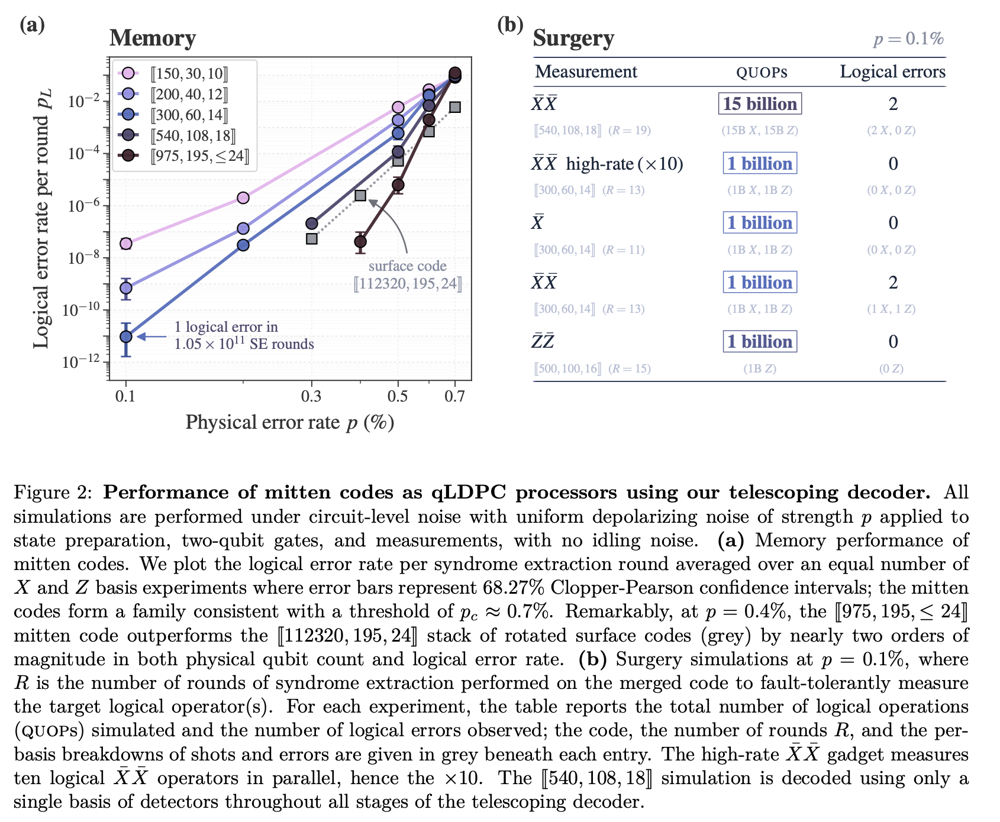
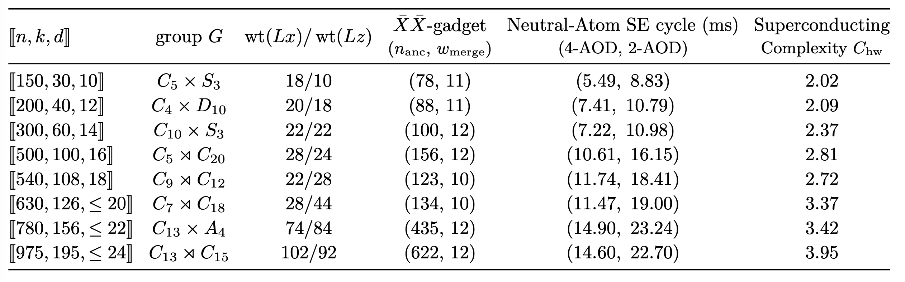
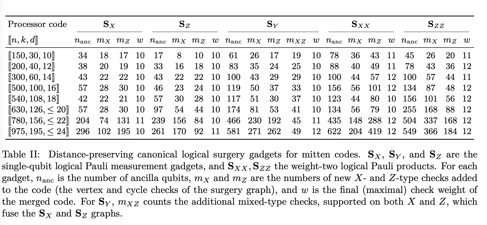

# High-rate qLDPC processors
[arXiv paper](https://arxiv.org/abs/2607.28795)

I skipped mathmetical details.

## Problems
- Building qLDPC processors that are high-rate, high-throughput, hardware-friendly, and fast-todecode remains a challenge.

## Contributions
- Encoding rate 20% qLDPC
- Check weight 9
-  Full Clifford operations follow from bridging just two reusable seed surgery gadgets of tens of qubits each, or from a single fixed extractor. 
- High-rate surgery
- Their decoder (_telescoping decoder_) achieves this accuracy while being compatible with sub-millisecond average latency per logical cycle, sufficient for real-time decoding on neutral atom hardware.
- The structure of the code aligns naturally with parallel block moves of atoms in neutral-
atom arrays, and for superconducting platforms 
- They made [sQetch](https://github.com/a7b/yarn) a python toolkit. 

## Assumptions
- Non-abelian groups.
- The lifted product codes
- Under circuit-level noise with uniform depolarizing noise of strength 𝑝 applied to
state preparation, two-qubit gates, and measurements, with no idling noise
- The [[540,108,18]] simulation is decoded using only a
single basis of detectors throughout all stages of the telescoping decoder.
- Non-local qubit movements such as on neutral atom arrays.
- Assume thickness of a processor for superconducting qubits

## Quick results
### Figure 2

### Table I

### Table II

## Questions
- In a previous controversal paper, they assumed 1 ms stabilizer measurement, but in this paper, no code achieves this in Table I.

## Hidden Problems
- They don't consider the synchronization problems caused by the difference of stabilizer weights between two gadgets in Table II. ←probably
