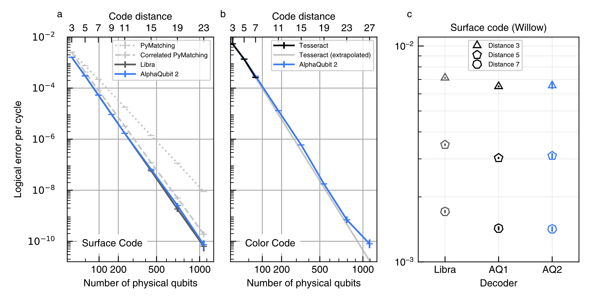
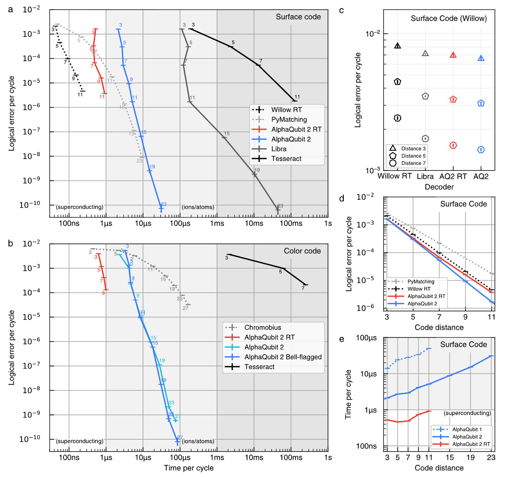
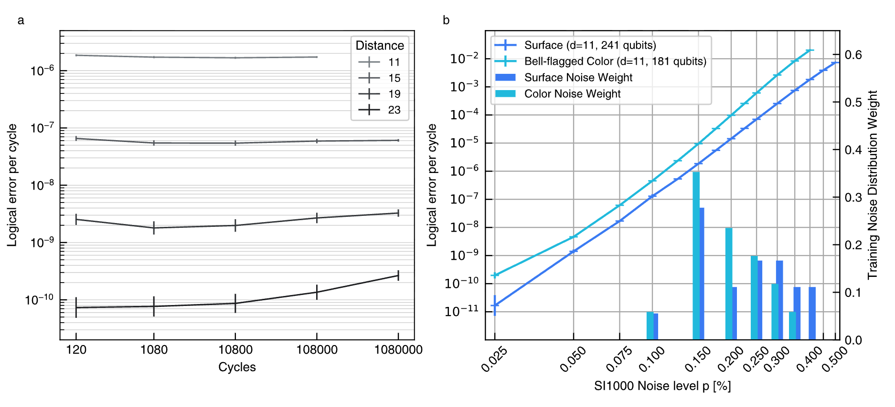

# A scalable and real-time neural decoder for topological quantum codes (AlphaQubit 2)
[arXiv paper](https://arxiv.org/abs/2512.07737)

Google DeepMind + Google Quantum AI (Senior, Edlich, Heras, ..., Bausch).

## Problems
- A decoder must be simultaneously **fast** (~1 μs/cycle for superconducting, ~1 ms for neutral atoms, else exponential backlog), **accurate** (LER $\le 10^{-10}$/cycle for useful FTQC, e.g. 2048-bit factoring), and **scalable**. No ML decoder met all three; no decoder at all met them for the color code.
- Persistent speed-accuracy tradeoff: MWPM/PyMatching fast but approximate; Libra/Harmony/Tesseract accurate but slow (Tesseract = A*-search, near-optimal, computationally very expensive).
- Color code (fewer qubits, cheaper logic) is hampered by lack of decoders: Chromobius fast but much less accurate (real-time only at d=3); Tesseract accurate but too slow to even evaluate beyond d=7.

## Contributions
- **AQ2 (accuracy model)**: near-optimal LER at scale under SI1000 0.15% noise, 120-cycle memory.
  - Surface code d=23: LER $7.3\times10^{-11}$/cycle, close to Libra, ≫ PyMatching.
  - Bell-flagged color code d=27 (3-model ensemble): $8.0\times10^{-11}$/cycle; tracks extrapolated-Tesseract ideal up to d=23 ←at d=27 it falls off the ideal trend (training too hard/expensive).
  - Orders of magnitude faster than other high-accuracy color-code decoders; sits on the Pareto front of accuracy-throughput; <100 μs/cycle up to d=27 (fast enough for neutral atoms / ions already).
- **AQ2-RT (real-time variant)**: <1 μs/cycle on commercial Trillium TPUs, **no ASIC/FPGA**.
  - Surface code up to d=11 (241 qubits), more accurate than leading real-time decoders (Willow RT matching); LER $3.73\times10^{-6}$ vs $1.89\times10^{-6}$ for full AQ2 at d=11.
  - **First real-time decoding of the color code**, up to d=9 (181 qubits) ←bigger accuracy drop than surface.
- Speed: full AQ2 is 9.6× faster than AQ1 at d=11, AQ2-RT another 6× on top. Streaming, constant cost/cycle independent of error content, latency <500 μs.
- Robustness: trained on ≤168 cycles, generalizes to **1M-cycle** experiments (small degradation at d=19,23); robust over ≥16× physical-noise variation without retraining or noise-level input.
- Willow experimental data (d=3,5,7): AQ2 & AQ2-RT beat Libra, comparable to AQ1 ←ML wins on real-device correlations not captured by Pauli DEMs.

## Assumptions
- Scaling results are **simulation only**: Stim + SI1000 circuit-level depolarizing noise at $p=0.15\%$ ←optimistic, assumes another Sycamore→Willow-sized hardware improvement (detection event density ~5%, Λ⪆5).
- Memory experiments only (no logical operations / lattice surgery decoding in this paper).
- XZZX rotated surface code; triangular color code in Bell-flagged and superdense variants (superdense for RT because planar readout + Chromobius comparison possible).
- Throughput = average time/cycle; final-measurement-to-answer latency explicitly NOT minimized.
- Willow results need 3-stage training: SI1000 pretrain → DEM-simulated finetune → finetune on experimental samples ←decoder is device-specialized.
- Evaluation limited to ~$2.5\times10^{10}$ shots ←LER $\le 10^{-12}$ regime cannot even be reliably measured yet.

## Method
- Per-stabilizer representation; **temporal compression**: groups of 3-6 measurement cycles embedded together (no accuracy loss), network runs at lower rate.
- Interleaved layers: lightweight **RNN layers** (temporal update per stabilizer, parameters shared) + **transformer layers** (spatial self-attention among all stabilizers at one instant, RoPE on qubit coordinates). AQ2-full: RNN;RNN;3×TF;RNN;3×TF;RNN;3×TF;RNN. No convolutions.
- Causal/streaming: only recurrent state carries history → decode while measurements stream in, fixed memory.
- Readout: mean-pool stabilizer states + per-observable learned embedding + cross-attention → P(logical flip).
- Training: Stim-generated examples over many distances/noise levels/durations; **code-distance curriculum** (easy→hard); distance-specific finetune + 2-3 model **ensembles** for the largest d; auxiliary loss = predict idealized noise-free logical observable at every cycle; 50% stabilizer input dropout on 80% of examples; Lion optimizer (Muon for finetuning).
- AQ2-RT: fewer layers (1 RNN, 2-3 TF, 1 RNN), 128 channels, element-wise gated (Griffin-style) recurrence, gated attention for color code.

## Quick results
(figs to add: Fig.3 accuracy-at-scale, Fig.4 accuracy-vs-throughput Pareto, Fig.5 robustness)

## Questions
- Real-time is d≤11 (surface): the distances needed for their own target ($10^{-10}$, i.e. d~23+) are decoded 100× too slowly. Path is "architecture innovation + low precision + windowing + FPGA/ASIC" → so the headline "real-time at scale" is a roadmap, not a result yet.
- Accuracy is per trained/finetuned model per code distance (+device finetuning for Willow). How much retraining is needed every time the hardware drifts / is recalibrated? ←cost of the training pipeline (billions of Stim samples, TPU fleet) vs. a parameter-free decoder like PyMatching.
- Throughput measured on Trillium TPU with batching — is the <1 μs *average* throughput compatible with the *latency* required for feed-forward in logical operations (T-gate teleportation needs the decode result before proceeding)? They admit latency (<500 μs) is unaddressed.
- Ensemble of 3 finetuned models at d=27 to get the headline color-code number ←ensembling multiplies hardware cost; distillation to a single student is only "may be possible".

## Hidden Problems
- Neural decoder gives P(logical flip) for a fixed final observable, not a Pauli-frame correction; integration into a full FT stack with mid-circuit logical branching is nontrivial.
- Deviation from ideal scaling exactly where it matters most (largest d, longest experiments); they concede training methodology doesn't converge there.
- $p=0.15\%$ SI1000 is below current hardware noise; at today's ~Willow noise the required distances (and hence real-time gap) would be larger.
- No comparison against recent MWPF/relay-style decoders on equal hardware footing (CPU vs TPU timing comparisons are apples-to-oranges).
