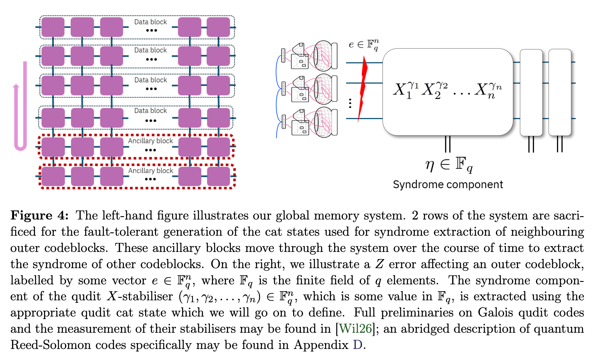

# Concatenating Algebraic Codes over High-Rate Quantum LDPC Codes
[arXiv paper](https://arxiv.org/abs/2605.21898)

IBM Quantum team (Wills, Beverland, Bishop, Gambetta, Rall, Siddhu, Cross).

## Problems
- QEC schemes trade off overhead, error suppression, and hardware connectivity. Concatenation over an inner code can supply the outer code's non-local connectivity by logical operations instead of hardware.
- Prior concatenation works used local low-rate inner codes (surface code, e.g. yoked surface codes [Gid+25]). High-rate inner codes (gross code) suffer **correlated errors** among the many logical qubits in one codeblock → naive concatenation with qubit outer codes fails.
- In yoked surface codes [Gid+25], the outer code is a single-parity-check (yoke), so cheap protection stops at outer distance 2; scaling to distances higher than 2 (multi-dimensional yokes: 2D → d=4, etc.) costs a much greater loss in encoding rate, and high-weight yoke measurements induce correlated failures. ←parity-check outer codes are far from MDS.
- The gross code alone could not reach the teraquop regime at $p=10^{-3}$.

## Contributions
- Treat each inner codeblock ([[144,12,12]] gross code, 12 logical qubits) as **one logical Galois qudit** ($GF(2^{12})$) → correlated errors inside a block become a single qudit symbol error.
- Concatenate with **quantum Reed-Solomon outer codes** (MDS: $d=n-k+1$, optimal distance-rate tradeoff, so outer distance can be dialed up smoothly, unlike yokes) + **list decoders**.
- Galois qudit **Shor-style syndrome extraction** with "time-like" Reed-Solomon protection against measurement errors.
- A lightweight fault-tolerance scheme that would fail for qubits works well for large-alphabet qudits ←suggests a very different theory of fault tolerance for large-alphabet qudits.
- Improved bicycle-instruction logical error rates, new compilation strategies (efficient cat state preparation via compiled Z measurements, Appendix A/B), decoder post-selection rules, morphing-based idling circuit (Appendix C).
- At uniform $10^{-3}$ physical noise: concatenated gross code reaches **teraquop regime** with **lower space overhead than the [[288,12,18]] two-gross code**, plus engineering advantages (modularity: modules can be re-calibrated or replaced during computation).

## Assumptions
- $m \times n$ grid of gross codes, only **square-grid (nearest-neighbor) connectivity** between modules; "bridged" lattice surgery allowed iff modules are adjacent in the grid.
- Native logical instruction set = "bicycle" instructions [Yod+25].
- Uniform circuit-level depolarizing noise $p=10^{-3}$.
- Memory (storage) system only, not full computation.
- $m-2$ rows hold data; 2 rows are ancillary, and which rows are ancillary changes over time.

## Method
- Rows of the grid = outer RS codeblocks of length $n$ (each symbol = one gross code block = one $GF(2^{12})$ qudit).
- Outer syndrome extraction: the 2 ancilla rows sweep through the grid. A data row is always adjacent to the ancilla region when serviced → columnwise nearest-neighbor lattice surgery between ancilla row and data row, then measure ancilla row.
- The vacancy (ancilla role) migrates like the empty tile in a sliding puzzle: logical contents are swapped/teleported into the freshly measured empty row using the same nearest-neighbor bridges; no long-range operations ever needed.
- Section 3: upper bound on logical error rate of one outer block per round. Section 4: overhead vs. logical error rate (per logical qubit-round).

## Quick results
(figs to add: screenshot Figure 4 = ancilla-row sweep, and the overhead-vs-error-rate plot of Sec. 4)

## Questions
- The presence of an outer code allows certain modules to be re-calibrated or even replaced while the rest of the computation continues — does the outer code enable replacing chips during computation? → Yes, RAID-like: each module is one RS symbol; taking a module offline is an **erasure** (known location), and RS corrects up to $d-1$ erasures vs. $\lfloor(d-1)/2\rfloor$ unknown errors. The logical state of the removed module is regenerated from the surviving blocks and re-encoded into the fresh module. ←caveats: modules offline must stay within the erasure budget; effective distance is temporarily reduced during the swap; the physical state on the removed chip is sacrificed, only the logical information survives.
- "In [Gid+25], scaling to distances higher than 2 requires a much greater loss in the code's encoding rate" — what does this mean? → Yoked surface codes use single-parity-check outer codes: distance 2 is nearly free (1 check block per row), but higher distance needs multi-dimensional yokes (rows+columns → d=4, ...), where each ×2 of distance compounds the redundancy and check weight. RS codes are MDS, so every check symbol buys a full unit of distance.
- In Figure 4, ancilla blocks extract syndromes from data blocks. How do ancilla blocks interact with data blocks that are not their neighbors? → They never do. The ancilla **role** moves, not the hardware: the 2 ancillary rows migrate through the grid over time (swap logical data into the emptied row via adjacent-row bridged lattice surgery), so every syndrome extraction is always between grid-adjacent rows. ←this rotation of the ancilla role through all rows is also why logical data is not pinned to hardware, matching the module-replacement story.

## Hidden Problems
- While the ancilla rows sweep, each outer codeblock is only serviced periodically (period ~ $m$) → outer syndrome extraction rate per block decreases as the machine grows; idling errors accumulate between visits. ←probably why they need the improved idling/morphing circuit of Appendix C.
- Chip replacement during computation assumes the erasure decoding + state regeneration is fast relative to error accumulation on the remaining blocks.
- Memory only: no scheme yet for logical computation (non-Clifford) on top of the RS layer.
