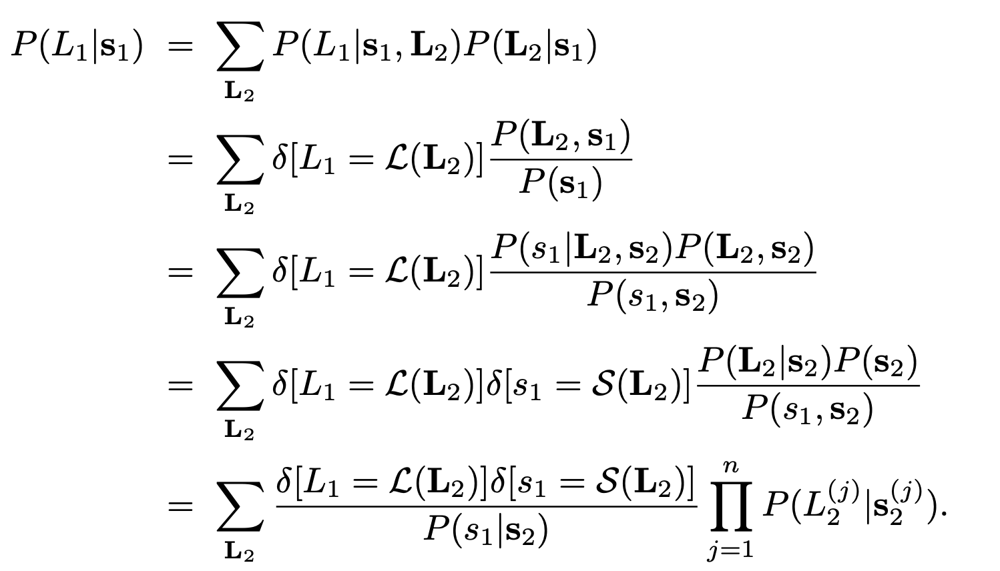

# Optimal and Efficient Decoding of Concatenated Quantum Block Codes
[arXiv paper](https://arxiv.org/abs/quant-ph/0606126)

## Problems
- we know from a classical result [3] that finding the optimal recovery
is NP-hard.

## Assumptions
- the important assumption that the channel is memory-
less, or more specifically, that the noise model does not
correlate qubits across distinct blocks (errors on qubits
in the same block could be correlated).

## Equations

- The last step relies on
the important assumption that the channel is memory-
less, or more specifically, that the noise model does not
correlate qubits across distinct blocks (errors on qubits
in the same block could be correlated).

- The factor graph associated to the function $P (L_1|s_1)$ is a tree 
- We have thus reduced optimal decoding
to a sum product problem (known as tensor network
contraction in quantum information science [17])

## Contributions
- we demonstrate an effcient [25] mes
sage passing algorithm that achieves optimal (maximum
likelihood) decoding for concatenated block codeswith uncorrelated noise.
- One first measures the syndrome from each of the $n^{l-1}$ blocks of n qubits of the last layer of concatenation, and optimally decodes them using the lookup table. One then moves one layer up and applies the same procedure to the $n^{l-2}$ blocks of the second-to-last layer, etc. When the initial error rate is below a certain threshold value, the probability $p_e$ that this procedure fails to correctly identify $L(E)$ decreases doubly-exponentially with $l$. Hence, this decoding scheme based on hard decisions for each concatenation layer is efficient, leads to a good error suppression, but is nonetheless suboptimal.