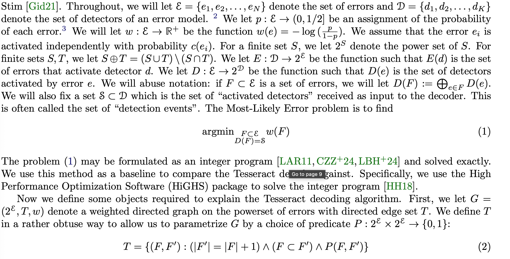
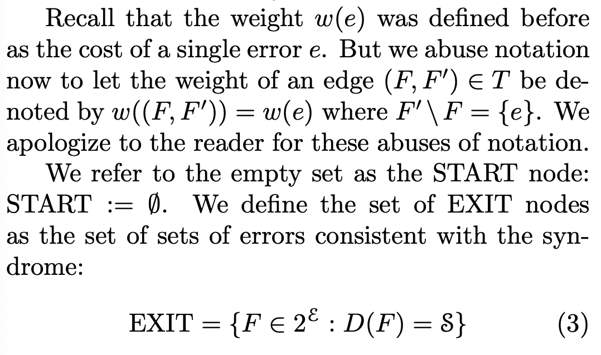
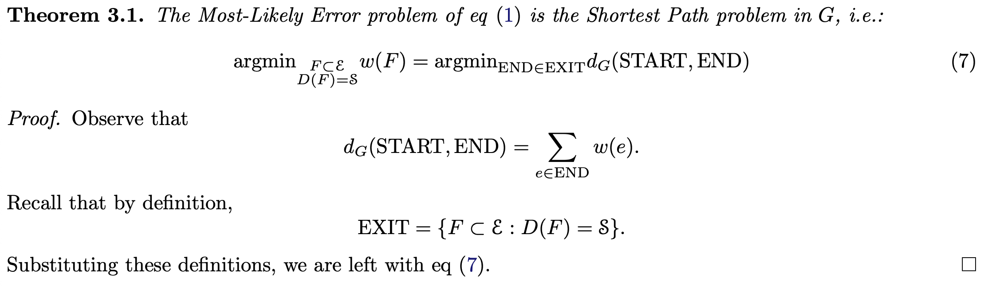
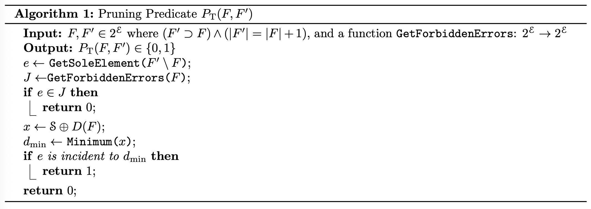
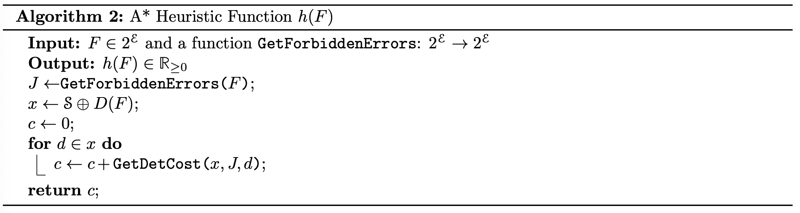
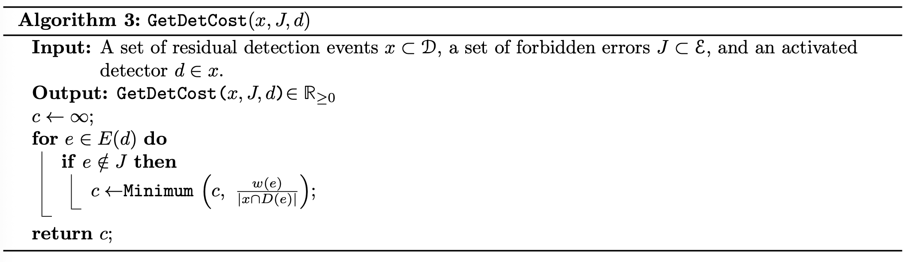
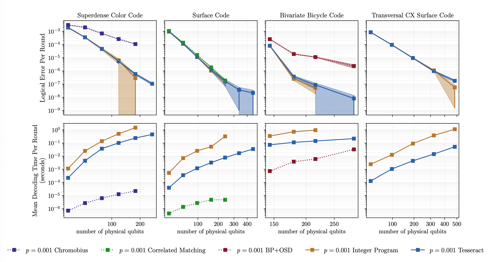
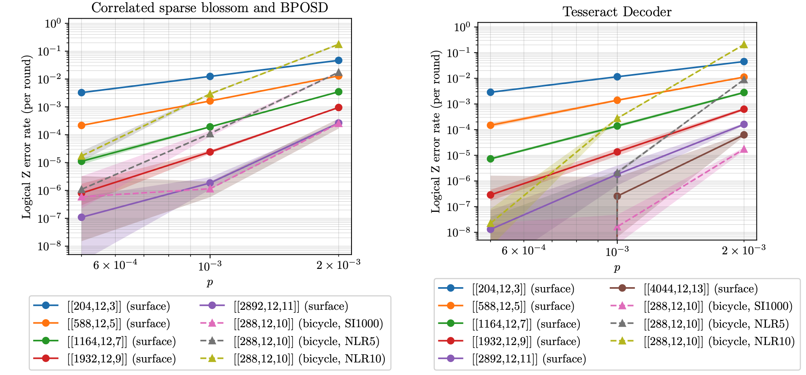

# Tesseract: A Search-Based Decoder for Quantum Error Correction
[Arxive paper](https://arxiv.org/abs/2503.10988)

## Problems
- A fast and accurate decoder is difficult.

## Approach
- We begin with an exponential-time algorithm that always identifies the
most-likely error and use heuristics to make it faster.

## Contributions
- At error rates of p ≤0.001, Tesseract achieves decoding accuracy nearly identical to that of the integer program decoder for both of the topological codes, while operating approximately five times faster. 

## Quick Definition

## Theorem

## Algorithms
### Algoorithm 1

### Algoorithm 2

### Algoorithm 3

## Quick Results

- We call these noisy long-range noise models “NLR5” and “NLR10”,
which use 5×and 10×higher noise strength for the two-qubit depolarizing channels after the long-range
CZ gates, but are otherwise equivalent to an SI1000 noise model. Using NLR10, at p = 0.1% we find that
the gross code (with circuit parameters [[288,12,10]]) is equivalent to distance 5 surface codes (rather than
distance 11 for SI1000) using BP+OSD, and is equivalent to distance 7 surface codes (rather than distance
13 or 15) when using Tesseract. In other words, qubit savings reduce from 10×(SI1000) to 2×(NLR10)
using correlated matching and BP+OSD, and from 14×-19×(SI1000) to 4×(NLR10) when using Tesseract.
