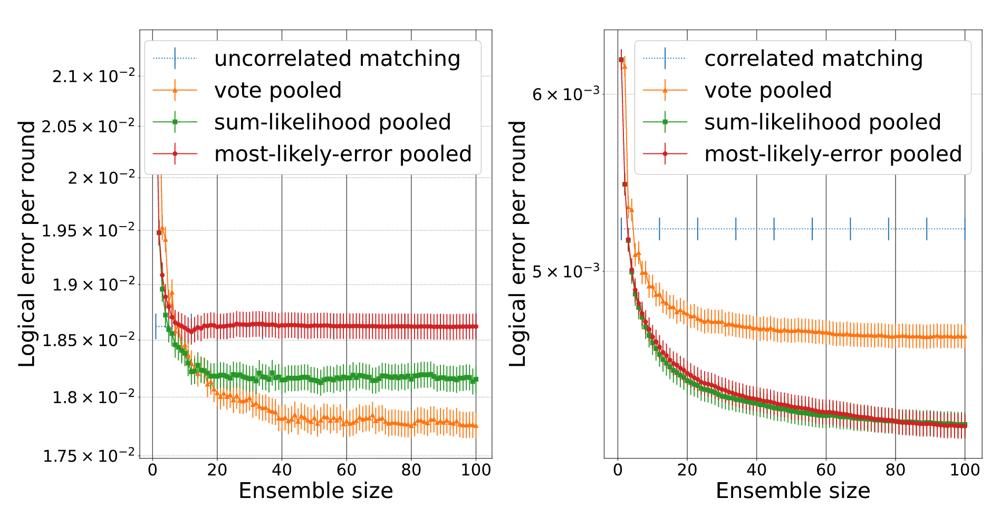
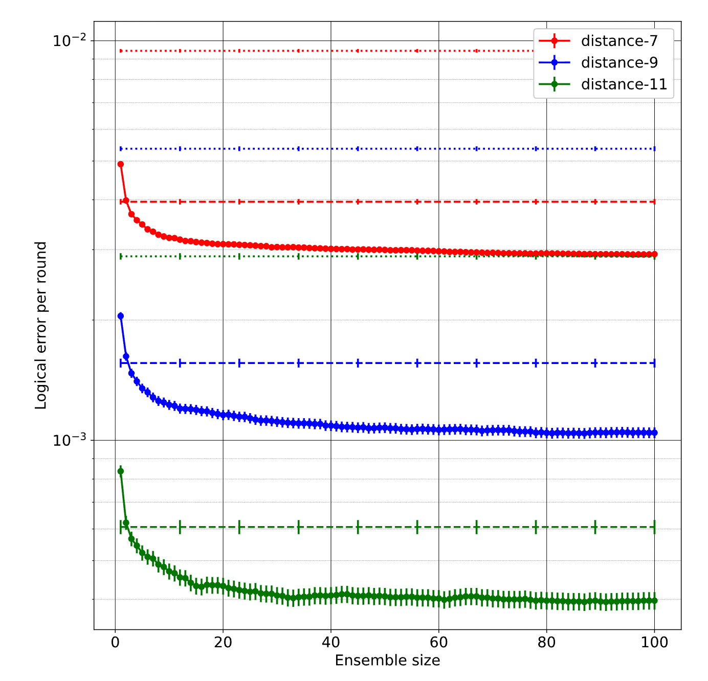
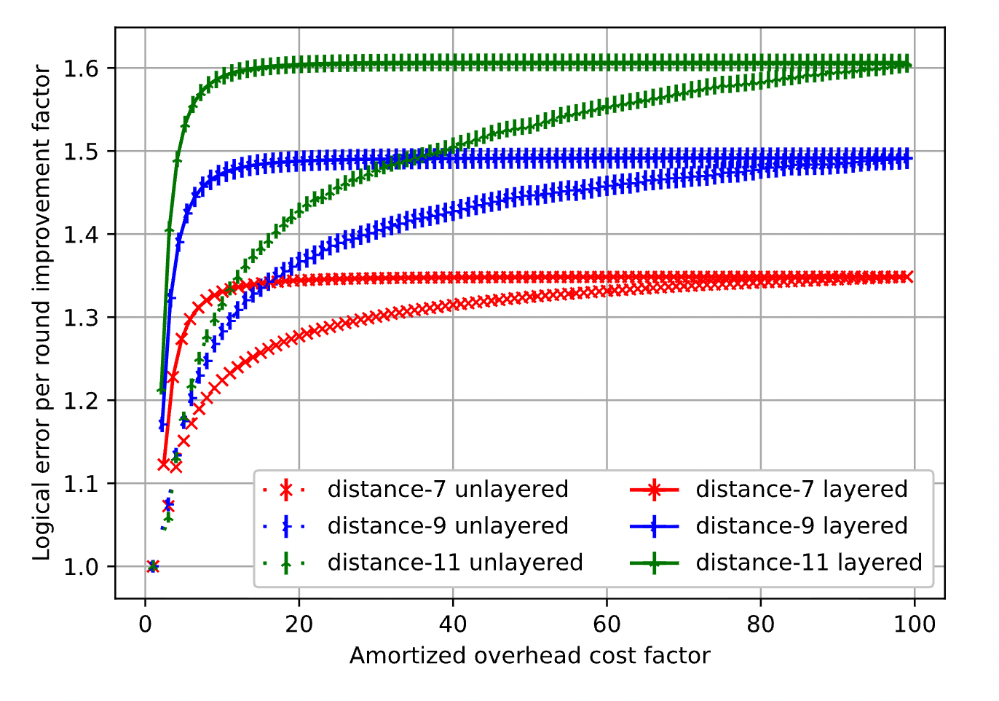

# Efficient near-optimal decoding of the surface code through ensembling (Harmony)
[arXiv paper](https://arxiv.org/abs/2401.12434)

Google Quantum AI (Shutty, Newman, Villalonga). ←"Harmony" is one of the high-accuracy baselines in AlphaQubit 2.

## Problems
- Persistent speed-accuracy tradeoff in surface code decoding: MWPM/union-find are fast but approximate; maximum-likelihood (tensor network) or most-likely-error (integer program, A*) decoders are near-optimal but can scale exponentially.
- Plain matching loses accuracy in two ways: (1) hyperedges (Y errors) are split into independent X- and Z-graph edges, discarding correlations; (2) matching finds the single most likely *error*, not the most likely *logical class* → blind to degeneracy.
- Want a decoder that is simultaneously efficient and near-optimal, and cheap enough for real time.

## Contributions
- **Harmonization**: ensemble of ~100 correlated matching decoders, each instantiated with a randomly **perturbed prior**. Individually worse than the unperturbed decoder; pooled, they approach maximum-likelihood accuracy.
- Benchmarks vs converged TNML decoder: repetition code (circuit noise, p=0.05) → near-ML via vote pooling; surface code phenomenological noise (p=0.04) → nearly bridges correlated-matching↔TNML gap; surface code circuit noise (p=0.004) → ensemble of ~100 saturates the benefit, ensemble of 3 already beats correlated matching, improvement grows with distance.
- Diagnosis of where the gain comes from: **degeneracy** for the repetition code (vote pooling best), **better use of Y-correlations** for the surface code (likelihood poolings best, ≈ each other).
- **Confidence from consensus** + **layered decoding**: first-pass ensemble N₁≈4 decodes all shots; any dissent escalates the shot to N₂=100. Saturates almost all of the accuracy gain at amortized cost ≈ N₁ (trigger rate is tiny at low p). ←embarrassingly parallelizable path to accurate real-time decoding.

## Assumptions
- Stim-generated circuits; repetition code & rotated surface code memory; circuit-level noise uses 2d rounds; phenomenological noise uses d rounds (to keep TNML tractable); TNML benchmark is approximate (MPS bond dimension χ, converged empirically; exact contraction cost exp in O(min(d², c·dr))).
- Perturbation constants tuned for correlated matching on the surface code: α₁=1, α₂=4/5, α₃=1/2 ←other codes/decoders may want different values.
- Perturbation is multiplicative and proportional (±α·p) → edge weights −ln p shift by only O(α) additive: reorders near-ties, doesn't promote absurd hypotheses.
- Accuracy only; wall-clock/hardware cost of running N parallel matchers is not benchmarked.

## Method
- Correlated matching (base decoder): (1) first MWPM on X/Z graphs with unconditional edge probabilities; (2) assert matched edges erred, reweight complementary edges of hyperedges to conditional (implied) probabilities, max over multiple assignments; (3) second MWPM → correction.
- Ensemble generation: each member samples, once at instantiation, $p^{(1)}_e \sim [(1\pm\alpha_1)p_e]$, $p^{(2)}_e \sim [(1\pm\alpha_2)p_e]$, $\tilde{q}_{e'|e} \sim [(1\pm\alpha_3)q_{e'|e}]$, all independent. Structure S(e) (which edges reweight which) never changes, only values. After sampling, each member is a deterministic correlated matcher with a slightly "wrong", internally inconsistent prior.
- Pooling: **vote** (majority over logical prediction), **sum-likelihood** (sum member likelihoods per logical class), **most-likely-error** (adopt the single member with the highest-likelihood hypothesis). Likelihood poolings need the error set, recovered from matched edges via a second small matching on the *edge decomposition graph* (Fig. 3).
- Layered decoding: consensus fraction of first-pass ensemble = confidence; second pass triggered iff any dissent. Alternative flag: complementary gap [yoked surface codes], plausibly pushing amortized cost → N₁≈1 (future work).

## Quick results
(figs to add: Fig.2 pooling comparison, Fig.6 circuit-noise surface code, Fig.7 layered accuracy-vs-overhead)

## Questions
- What is the difference between a probability and an implied probability? → $p_e$ = unconditional prior of edge e (sets first-pass weights $-\ln p_e$). Implied $q_{e'|e}$ = probability of e′ *conditioned on e being used* in the first matching. It is where the correlation discarded by splitting Y-hyperedges into independent X/Z edges is stored: if the X-component of a Y error is matched, the complementary Z edge jumps from unlikely to near-certain in the reweighting step.
- From Eq.(3), why is this value q random? → The true $q_{e'|e}$ is fixed; the randomness is injected on purpose to manufacture the ensemble. Each member samples its own $\tilde{q}$ (and $p^{(1)}, p^{(2)}$) once, then runs deterministically. N identical decoders would give N identical answers; the jitter creates useful disagreement — on easy shots everyone still agrees, on near-tied shots members split roughly in proportion to hypothesis plausibility, so pooling ≈ crude Monte Carlo over the likelihood landscape.
- Is q completely determined by $p^{(1)}$ and $p^{(2)}$? → No. All three are sampled independently (Eqs. 1-3). In the unperturbed decoder q *is* derived from the underlying hypergraph model, but Harmony deliberately perturbs the three ingredients separately → each member's config is not consistent with any single noise model. Three independent diversity knobs: α₁ = which initial matching, α₃ = how strongly correlations propagate, α₂ = the baseline the reweighted edges compete against.
- So $q_{e'|e}$ is perturbed into $\tilde{q}_{e'|e}$? → Yes; tilde = perturbed version, sampled from [50%, 150%] of the true value (α₃=1/2), independently per (e′,e) pair per member. Only the values change; the reweight structure is shared by all members.
- What is vote pooling? → Majority vote over the members' binary logical predictions, equal say per decoder. It is the only pooling that accounts for **degeneracy** (a logical class can win by containing many moderate-probability errors rather than one dominant one) — hence best for the repetition code, where MWPM is already exactly most-likely-error and degeneracy is the entire remaining gap to ML. In the surface code, likelihood poolings do at least as well → surface-code gains come mostly from correlations, not degeneracy.
- What does "low degree of consensus suggests the task is high-risk" mean? → Dissent among perturbed decoders is a symptom of a near-tie between the two logical classes — exactly the shots where even an ML decoder fails with probability ≈ 1/2. Consensus fraction is thus a free confidence score (votes are computed anyway): use it to restart in try-until-success settings (magic state prep) or, for general computation, to escalate only flagged shots to the big ensemble (layered decoding).

## Hidden Problems
- Confidence flag with N₁=4 only triggers on dissent; a shot where all 4 members agree *wrongly* (correlated failure of the ensemble, e.g. all trapped by the same bad first-pass matching) is silently accepted.
- α values are hand-tuned per code/decoder/noise; no principled prescription, so porting Harmony to color codes / qLDPC needs re-tuning.
- Amortized cost ≈ N₁ hides worst-case burst: a triggered shot costs 100+ decoder runs at once — real-time systems care about tail latency, not just the average.
- TNML benchmark is itself approximate (finite χ, phenomenological noise for surface code at higher d; circuit-level TNML too expensive) → "near-optimal" is measured against an extrapolated/approximate optimum.
