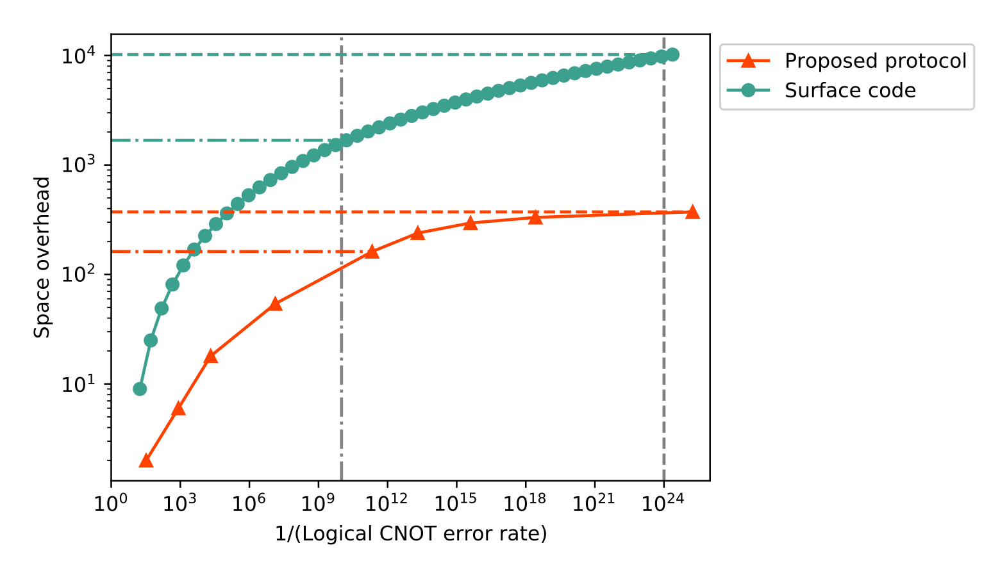
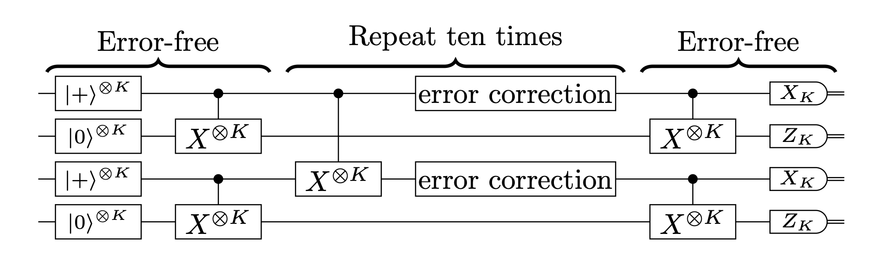
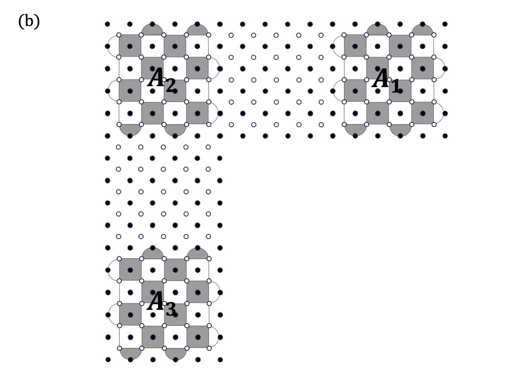

# Concatenate codes, save qubits
[Arxive paper](https://arxiv.org/abs/2402.09606)

## Assumptions
- All-to-all connectivity (they stated this is indispensable)
- No geomtrical contraints (←this is not practical)
- They fucus neutral atom, optics and trapped ions.
- Circuit level uniform depolariziing model.
- They ignore the error and the runtime of polynomial-time classical computation used for decoding in the fault-tolerant protocols.

## Method
- They employed $[[4,2,2]]\rightarrow [[6,2,2]] \rightarrow [[6,2,2]]\rightarrow [[6,2,2]]\rightarrow [[6,2,2]]\rightarrow 2_5 \rightarrow 2_6 \rightarrow 2_7 \rightarrow 2_7$.
- The upper concatenation has the highest density. They also tried replacing first C4C6 code to Steane code, Surface code and C4/Steane (←this is horrible).
- Used Knill gadget.

## Quick results

## Questions

- They emplyed a circuit shown in Fig.5 for concatencated-code CNOT by using transversal CNOT. However, for the surface-code CNOT they employ the lattice surgery. Is it fair comparison? → the lattice surgery is more widely used in the literature on resource estimation for FTQC, and the threshold of the lattice surgery
CNOT is better than the transversal CNOT.

- How did they implement the lattice surgery in the surface code. Does this affect the final results? Fig.S9 introduce the many ancilla qubits. This is not optimal.

- The results must be different if we use a different decoder.

